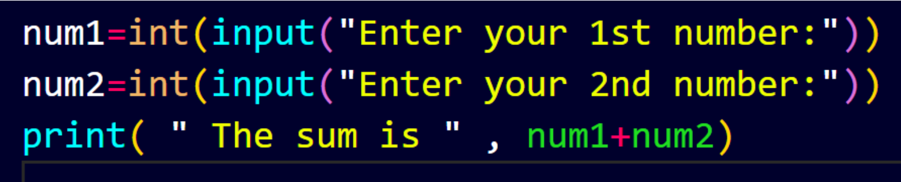
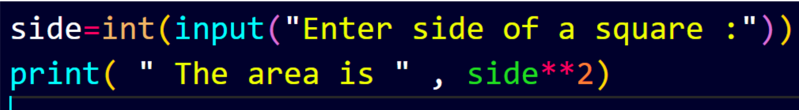

# Python
# What really is a python?
- High level language.
- Case sensitive.
- Use Inetrpreter as a translator.
- Developed by Guido Van Rossum.
- Can run in different operating systems. Example, if i write a python code in window the same code can be run in mac or linux.

# Variables
- Variables are the name or symbol that stores values in memory.(Primarily in RAM)
- Example, name= “Parbat”, here, name is a variable and Parbat is a value. Similarly, age=19 , here, age is a variable and 19 is a value. However, we don’t put “  ” in a number.

#  Rules to define identifiers(Variables and functions)
- An identifier cannot start with digit. So, Var1 is a valid variable but 1Var is not valid.
- Identifier can be combination of upper case , lower case, 0-9 and underscore.
- Identifier can be of any length 
- We can’t use any special symbol like @, $, #, !, & etc.

 # Data types
- Integer (It contains +ve,-ve,and 0). Example, (25,-25,0)  Syntax: Int
- String ( Anything inside  “  ”  , ‘  ’ ,  “‘  ’’’  , ). Example, “Parbat” , ‘Hello world’ .
- Float (Number with decimal). Example, ( 25.0 , 45.34).
- Boolean ( True , False ) ; T and F should be capital.
- None ; N should be capital . Example, a =None.
# We can print the type of a varibale 
name= “parbat”
Print(type(name)) # It gives the type of data stored in a variable.

Output: Str; Short form for string

# Keywords
- Keywords are reserved words in python.
- We can’t  use keywords as a variables. i.e We can't use print="Parbat" because print is a keyword in python.
- The following are some keywords.

| Python Keyword | Python Keyword | Python Keyword | Python Keyword |
|---|---|---|---|
| `and` | `elif` | `is` | `None` |
| `as` | `False` | `except` | `in` |
| `True` | `nonlocal` | `for` | `try` |
| `class` | `from` | `while` | `pass` |
| `def` | `continue` | `not` | `raise` |
| `break` | `lambda` | `with` | `or` |
| `else` | `return` | `global` | |
| `if` | `finally` | `yield` | |
| `del` | `assert` | `import` | |

# Comments

- Commets are used to understand code if we see it in furture. 
- It won’t run with code.
- We can use  **#** for comments or  **"""** .

**Then what's the different between these two?**
**#** is used when we have to comment a single line and **"""** is used when we have to comment down multiple lines.
- For instance, #Hello i'm a single line comment

 """Hello ,

 I'm a multi-line comment.

 Nice  to meet you"""

 **See the difference?**

# Operators

- An operator is a symbol that performs a certain operation between operands.
 

# Types:

- Arithmetic Operators (  + , - , * , / , %, ** )   % is used for remainder and ** is power ex, 2**2 =4

- Relational / Comparison Operators ( == , != , > , < , >= , <= )

- Assignment Operators ( = , +=,  -= , *=,  /=, %= , **= )  

# += is 
sum=10                     or          sum=10
Sum=sum+20                             sum+=20

- Logical Operators ( not , and , or )

# To give data in python 

- Syntax :**input(" ")**
- Input normally take string or  even if we put number it assume it as a string.
- So to enter number we have to use different syntax   i.e.

 **int(input(“enter some number”))**

 # Let's practice some question.

 Q1)WAP to input 2 numbers and print their sum.
 
 

 Q2) WAP to input side of a square and print it’s square.

 

 